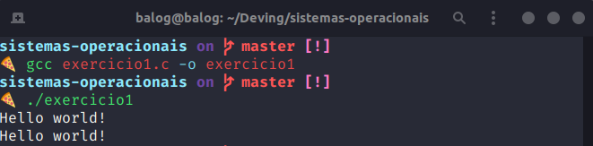
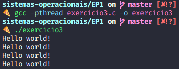

# EP 1 - Criando Processos e Threads

- Gabriel Hoffman - 10783250
- Guilherme Balog - 11270649

## Informações gerais

Os programas foram desenvolvidos no Ubuntu 20.04 64 bits. Para implementar os programas utilizamos o [Visual Studio Code](https://code.visualstudio.com/), que é um editor de código open source. Os exercícios em C foram compilados com o compilador `gcc` versão 9.3.0, que já está incluído no Ubuntu por padrão. O exercício em java usa a versão openJDK 11.0.8, que já estava instalada.

## Exercício 1

Criação de um processo pai, “hello world”, fork processo filho, “hello world”,finalização de ambos. Válida qualquer linguagem de programação.

### Resolução 1

Neste exercício, nós utilizamos a função `fork()` da biblioteca `unistd.h` para realizar o processo de fork do processo em questão. O fork funciona basicamente criando processo filho para o processo pai que é executada utilizando o mesmo *program counter*, registradores e arquivos do processo pai, ou seja, a partir da linha do fork, ambos os processos serão executados concorrentemente.

Para compilar é necessário utilizar o `gcc`, que é um compilador de C. O comando para compilar é:

```bash

gcc exercicio1.c -o exercicio1

```

Dependendo da plataforma utilizada, a extensão do arquivo de saída pode variar, sendo `exercicio1.exe` no Windows ou `exercicio1` no Linux. E para executar basta executar o comando `./exercicio1` no terminal.

Como *output* teremos as seguintes linhas:



Sendo que um dos `printf()` é referente ao processo pai e o outro ao processo filho.

---

## Exercício 2

Criação de um processo, criação de várias Java threads, “hello world” de todos, finalização.

### Resolução 2

Nessa resolução utilizamos a classe `Thread` que serve para lidar múltiplas threads. O construtor recebe um `Runnable` como parâmetro, que é uma interface da classe `Thread` do Java, esta sobrescreve o método `run` da classe `Thread` e este é o responsável por exibir o `Hello world!`  ou executar qualquer outro comando que se deseja que a thread em questão faça.

Além da criação da thread também utilizamos o método `start()` para iniciar a execução da thread em questão.

Para compilar é necessário utilizar o comando `javac exercicio2.java` e rodar com `java exercicio2`. 

Como *output* temos as seguintes linhas:

```bash

Hello world!
Hello world!
Hello world!

```

Por padrão estamos iniciando 3 threads, mas o esse número pode ser alterado passando a quantidade como argumento ao executar o programa. Alguns exemplos:

- **Iniciando 10 threads:**
  
  

  É interessante notar que as threads não são finalizadas na mesma ordem em que são iniciadas, por isso os números não estão em ordem.

- **Iniciando 3 threads várias vezes**

  

  As threads podem ser executadas em ordens diferentes cada vez que executamos o programa.

- **Iniciando 1 milhão de threads**

  

  Como era de se esperar, esse processo foi bem mais demorado e exigiu mais da máquina, inclusive a ventoinha começou rodar mais. O tempo para executar foi de 2 minutos e 41 segundos.

---

## Exercício 3

Criação de um processo, criação de várias POSIX threads (código fonte em C ou C++), “hello world” de todos, finalização.

### Resolução 3

Aqui tivemos uma solução que se parecia muito com a desenvolvida em Java, porem, como era de se esperar em C, com um nível um pouco mais baixo. Isso porque ao utilizar o POSIX temos que manipular dados como o ID da thread e os atributos da thread de forma manual.

Uma diferença que foi observada entre o C e o Java é que no C não precisamos iniciar a thread, ao criá-la ela já inicia a execução simultaneamente.

Pra compilar, novamente utilizamos o `gcc`, mas é necessário usar a *flag* `-pthread`.

Como *output* temos as seguintes linhas:



---

## Referências

- Trabalhando com threads - [https://www.devmedia.com.br/trabalhando-com-threads-em-java/28780](https://www.devmedia.com.br/trabalhando-com-threads-em-java/28780).
- Livro "Fundamentos de Sistemas Operacionais by Abraham Silberschatz, Peter Baer Galvin, Greg Gagne.", livro texto da disciplina.
